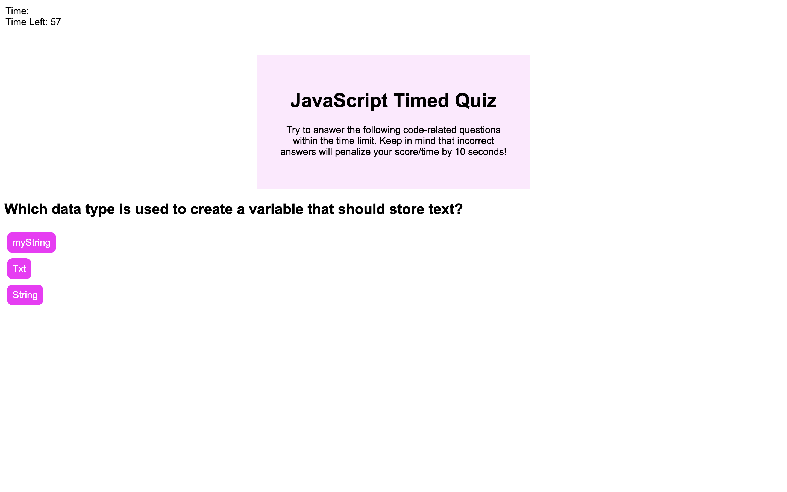

# Code-Quiz
# Javascript timed Quiz
## Purpose
The purpose of this page is to have users compete a timed JavaScript quiz.  
Users with have 60 seconds to compete test and time will be subtracted if a 
question is answered incorrectly. At the end they will be prompted to input initials
so they can see their time left.  

## Built With
* HTML
* CSS
* JS

## Lessons Learned
- How to use an array to present questions
- Using local storage to save results

### Web link:
- My [website](https://vhivestate.github.io/code-quiz/)

## Screenshot

## Contribution
Made with ❤️ by Valeria Garcia